# Some Processing Things

**binary/**

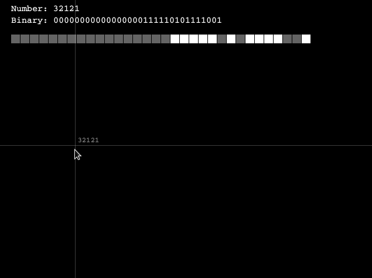

**blocks/**

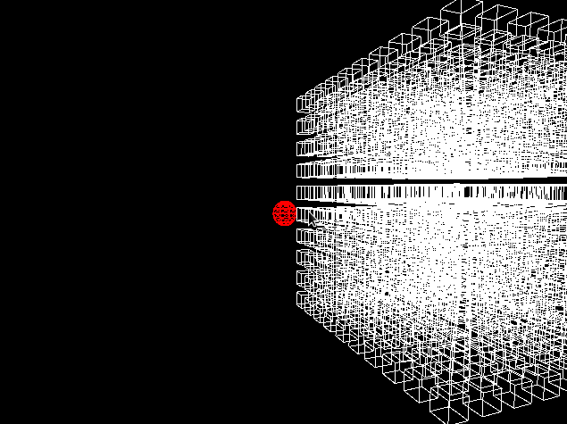

**bouncingball/**

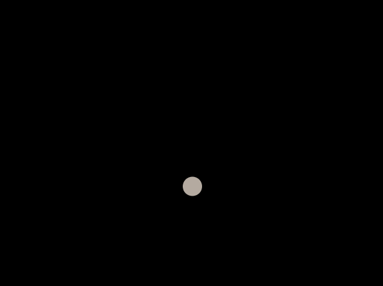

**colormixer/**

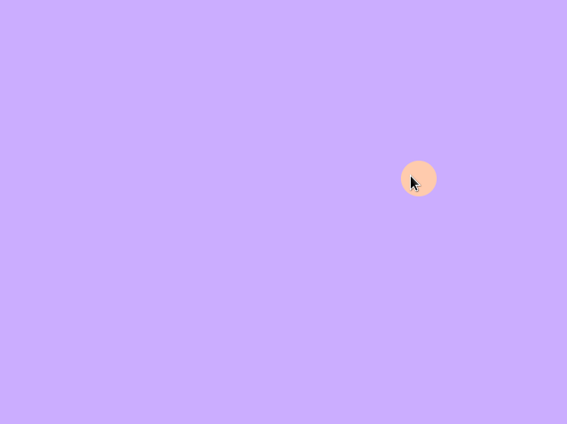

**dimensions/**

**field/**

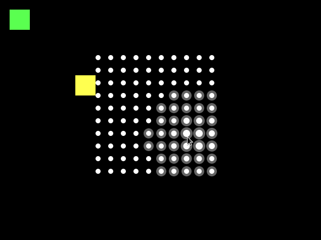

**game/**

**gui/**

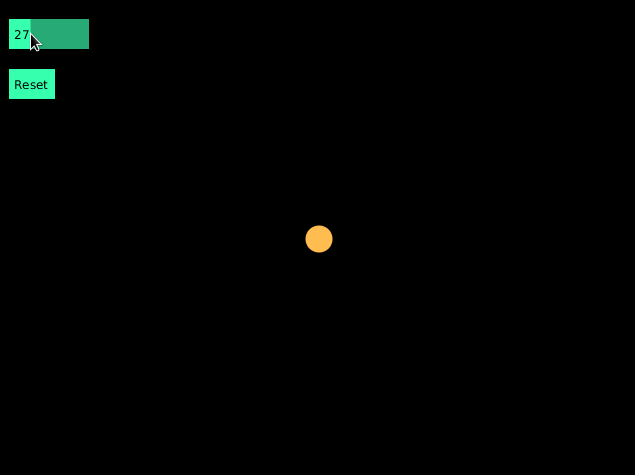

**imageTest/**

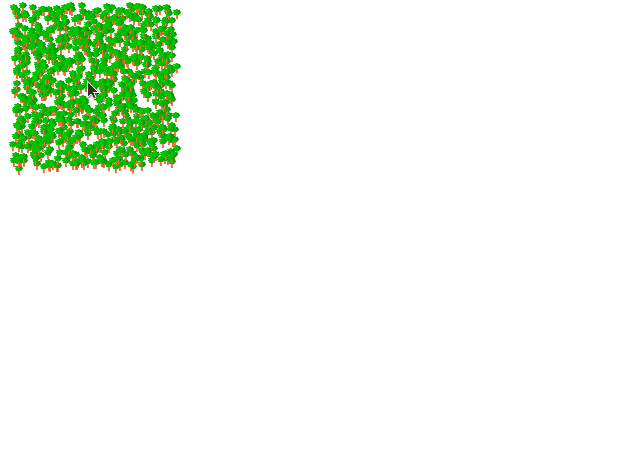

**jittery/**

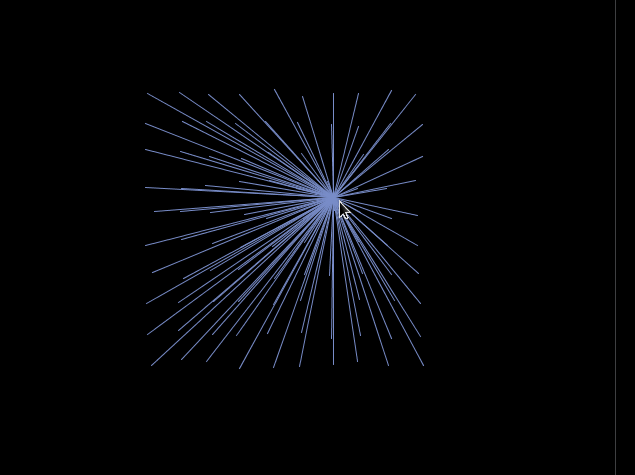

**lerper/**

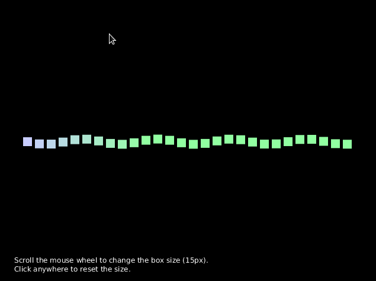

**noise/**

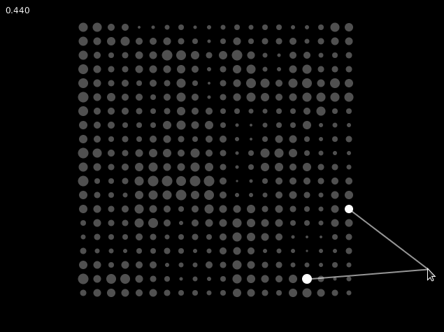

**opart/** *(Yes, it should look that way.)*

Get close to your device and stare at **opart.png** for a while.

**pixels/**

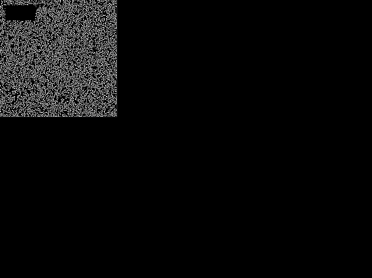

**redblue/**

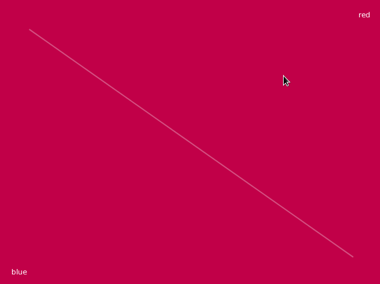

**resizable/**

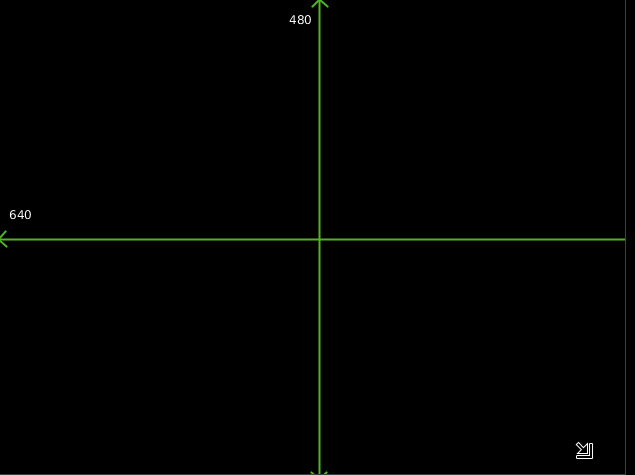

**rogueblock/**

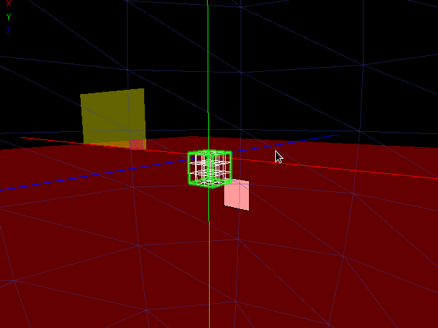

**rotation/**

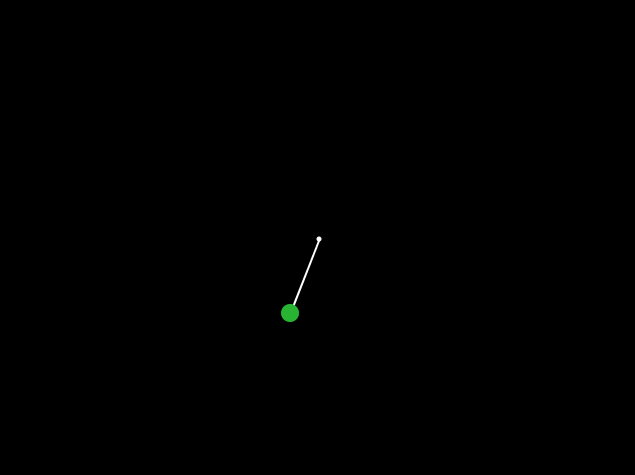

**spline/**

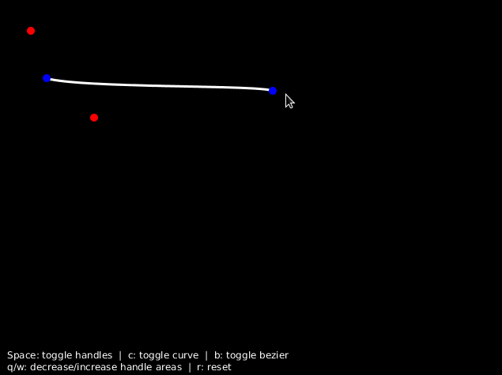
